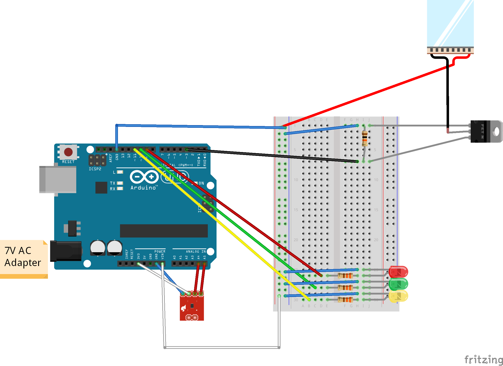

# NoViz-Thermal

This repository includes all of the code for the NoViz-Thermal prototype we use to explore how non-visual feedback can support users in behaving securely online. We collect TLS data through a Mozilla Firefox browser extension. This data is communicated to our node server and communicated to an Arduino Uno which controls a heating pad. The heating pad changes temperature based on the security information gathered from our browser extension. This system can be used to supplement or replace traditional HTTPS warnings.

=== The Team ===

This prototype started as Daniela Napoli's course project for exploring the role of embodied cognition in usable security. Sebastian Navas refactored and optimized the web app to what you can see today! 

Right now, we're exploring ways to improve thermal feedback and other potential non-visual feedback implementations. If you would like full details about the project, feel free to email: daniela.napoli[@]carleton[dot]ca

This prototype was inspired by...

- [Wilson et al.'s exploration of thermal feedback](https://dl.acm.org/doi/pdf/10.1145/3027063.3053127)
- [Liz Coelho's controllable heater project](https://astronomersanonymous.wordpress.com/2016/04/02/controlling-heating-pads-with-arduino-uno/)
- [Reginald Watson's Open Sound Control (OSC) web app example](https://maker.pro/arduino/projects/learn-how-to-enable-communication-between-an-arduino-and-web-browser)

# Documentation

Welcome to the thermaltrackpad project! In the next few lines we will explain what you need to get this working. As we continue with the development of this project, this list may change in the near future. 

### For this project you will need:

Software: 
[Arduino IDE](https://www.arduino.cc/en/Main/Software), [Processing IDE](https://processing.org/download/), [MongoDB](https://docs.mongodb.com/manual/installation/), [Firefox Browser](https://www.mozilla.org/en-CA/firefox/new/), [NodeJS](https://nodejs.org/en/) 

Hardware:
1 [Thermoelectric Cooler](https://www.sparkfun.com/products/15082), 1 [N-Channel MOSFET](https://www.sparkfun.com/products/10213), 1 [TMP102 digital temperature sensor](https://www.sparkfun.com/products/11931), 1 10k ohm resistor, 1 Arduino Uno Rev 3 or equivalent, Three LEDS and 3 330 ohm resistors (for testing), Wire, alligator clips, breadboard

### To set up the repository
Using the command line...
1. Navigate to the directory where you want to place the repository
1. `git clone https://github.com/danielanapoli/thermaltrackpad.git`
1. `cd thermaltrackpad/trackpad/server`
1. `npm install`
1. Look at the file called config-example.json in the resources folder
1. Create a config.json file following the example and store it in the resources folder

### To set up the extension
1. Open your Firefox Browser
1. In the search bar type: `about:debugging`
1. On the left of the screen, click on the **_This Firefox_** button
1. Click on the **_Load temporary Add-on..._** button
    - This will pop-up your file system
1. Use the pop-up to navigate to our repository
1. Inside the repository, you will find a folder called **_extension_**
1. Pick the file called **_manifest.json_**
1. Click on the **_open_** button

### To set up the Arduino
1. [Follow the picture at the bottom to assemble the hardware](#arduino-circuit)
1. Open the Arduino IDE
1. Click on the **_File_** button at the top of the screen
1. Click on the **_Open..._** button
    - This will pop-up your file system
1. Use the pop-up to navigate to our repository
1. Inside the repository, you will find a folder called **_arduino_** that contains a folder called **_thermaltrackpad_**
1. Pick the file called **_thermaltrackpad.ino_**
1. Click on the **_open_** button
1. Install the **_VSync.h_** library
    - You can find instructions here: https://github.com/erniejunior/VSync
1. You can now connect the Arduino board to your computer using the USB cable
1. Go to **_Tools_->_Port_** and choose one to communicate to the board

#### Don't upload the sketch yet! We still have to set up other things

### To set up Processing
1. Open the Processing IDE
1. Click on the **_File_** button at the top of the screen
1. Click on the **_Open..._** button
    - This will pop-up your file system
1. Use the pop-up to navigate to our repository
1. Inside the repository, you will find a folder called **_osc_** that contains a folder called **_processing_**
1. Pick the file called **_processing.pde_**
1. Click on the **_open_** button
1. Install the needed libraries by going to **_Sketch_->_Include Library..._->_Add Library..._**
    1. Use the filter to look for:
        - VSync
        - oscP5
    1. The install button is at the bottom-right of the screen
1. Make sure that the variable `port` (line 24) is set to the port being used for the Arduino 
    1. You can check the port in the Arduino IDE by going to **_Tools_->_Port_**

#### Once you have set up everything mentioned above, you can run everything
1. Get the web app running:
    - Using the command line
        1. Navigate to our repository
        1. `cd trackpad/server/`
        1. `npm start`
        1. Go to Firefox Browser 
        1. Search for http://localhost:8080/
1. Make sure that your extension is set up
    - **Note:** Everytime you open the Firefox Browser, you will have to set up the extension again
1. Upload the Arduino sketch to the board
1. Run the Processing sketch

# Arduino Circuit

